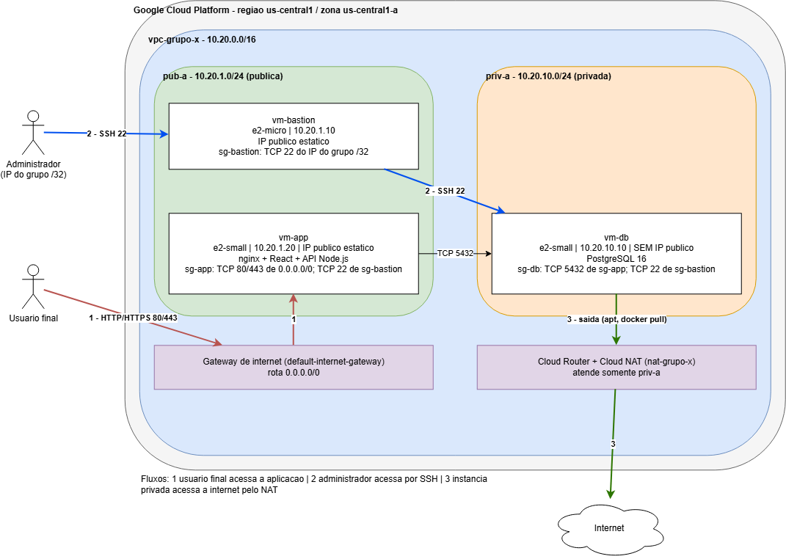


## 5.2 Diagrama de arquitetura

Arquivo editável: [diagramas/arquitetura.drawio](diagramas/arquitetura.drawio). Imagem exportada: [diagramas/arquitetura.png](diagramas/arquitetura.png).

**Elementos do diagrama**
- Provedor, região e zona: GCP, `us-central1`, `us-central1-a`.
- Rede virtual: `vpc-grupo-x`, `10.20.0.0/16`.
- Sub-rede pública `pub-a` (`10.20.1.0/24`): `vm-bastion` e `vm-app`, ambas com IP externo estático.
- Sub-rede privada `priv-a` (`10.20.10.0/24`): `vm-db`, sem IP externo.
- Gateway de internet: rota padrão `0.0.0.0/0` para `default-internet-gateway`.
- NAT gerenciado: Cloud Router + Cloud NAT (`nat-grupo-x`), atendendo somente `priv-a`.
- Regras de firewall: `sg-bastion`, `sg-app` e `sg-db` (ver seção 5.5).

**Como a segmentação pública e privada é representada na GCP.** A VPC é global e as sub-redes são regionais; nenhuma sub-rede é pública ou privada por natureza. Neste projeto, `pub-a` é pública porque suas VMs recebem IP externo e regras de firewall que permitem tráfego de entrada. `priv-a` é privada porque suas VMs não têm IP externo e só alcançam a internet pelo Cloud NAT, sem aceitar conexões iniciadas de fora.

**Fluxos numerados**

| Fluxo | Caminho |
|---|---|
| 1. Usuário final acessando a aplicação | Navegador, internet, IP externo da `vm-app` (TCP 80/443), nginx serve o frontend e faz proxy de `/api` para o backend local |
| 2. Administrador acessando via SSH | IP do grupo (`/32`), TCP 22 no IP externo da `vm-bastion`, depois SSH interno para `vm-app` ou `vm-db` |
| 3. Instância privada acessando a internet pelo NAT | `vm-db` (sem IP externo), rota `0.0.0.0/0`, Cloud NAT, internet (atualizações de pacotes e imagens Docker) |
| Interno | `vm-app` acessa `vm-db` na porta TCP 5432 |
